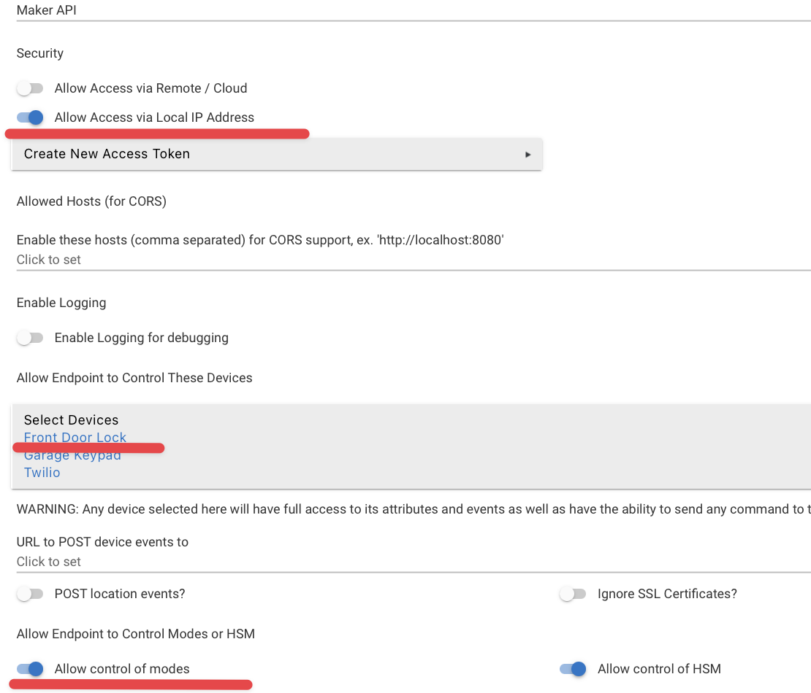

## Airbnb Lock Coder for Hubitat

This script is designed to program a lock code & set a mode on a Hubitat hub at Airbnb checkin/check out times.

This runs on a raspberry pi in my house on the same network as the Hubitat.


## Installation & Usage

* Install the Hubitat app 'Maker API'.  Make sure you give it access to your locks and modes, and make note of the hub's IP address and access token it provides.
  
* Git clone this repo to a folder 
* Enter that folder and run `npm install`
* Edit the `config/default.json` to fit your needs.  Generate a pushover.net app & user token for push notifications.
  * Set `ical_url` to your Airbnb iCal URL
  * Optionally set `houfy_ical_url` to your Houfy iCal URL
* Run `node index.js`.  


There are three new optional keys that may not be obvious.  If you want to set an "arriving soon" mode, you can use these keys.  The first is the time the mode will be enabled, the second is the offset from the check-in day.

I use this to turn on my water heater.  I want to make sure guests have hot water when they arrive, so I need to turn it on prior to coding the lock and putting the home into "home" mode.  So I have an "arriving soon" mode that turns on the water heater at 1:00AM on the day of arrival.

If you want this to run a day *before* arrival, set arrivingSoonDayOffset to -1


```
    "arrivingSoonTime": "1:00 AM" //
    "arrivingSoonDayOffset": 0,
    "arriving_soon_mode":"ArrivingSoon", //what mode to enable
```


I recommend using a node process manager like _pm2_ to run it on startup.


## Differences between durability of this vs RBoy's Rental Lock Automator
Hopefully, most of us chose Hubitat because it doesn't require internet access!  RBoy's app could fail to program your lock if the internet is down at check-in time.  That said, RBoy's app has excellent retry mechanisms in place that I have not evaluated.  Currently, I program the lock, ask to refresh its status, then see if the code is present.  If not, I retry a few times.

I always recommend putting a backup code into the lock in one of its permanent slots.  That way, if a guest calls you and says their code is not working, you can always provide that backup code for their stay - then just change it afterwards.

## Changelog

* 0.1.10: Fix crash when no schedules are found
* 0.1.9: Do not bail if lock 1 of x fails programming.  Keep programming the rest.
* 0.1.8: Also send notifications for new schedules found (not part of initial startup)
* 0.1.6: Bug related to checking if a date is in the past when it occurs today
* 0.0.5: Another quick bug fix related to the same as below.
* 0.0.4: Fix to removing deleted schedules over and over again
* 0.1.3: Added support for "arriving soon" actions.
* 0.1.2: Option to run check-out actions immediately if a reservation is canceled mid-stay.
* 0.1.1: Fix for removing lock codes
* 0.1.0: Initial commits


## License
 
The MIT License (MIT)

Copyright (c) 2023 Kristopher Linquist

Permission is hereby granted, free of charge, to any person obtaining a copy of this software and associated documentation files (the "Software"), to deal in the Software without restriction, including without limitation the rights to use, copy, modify, merge, publish, distribute, sublicense, and/or sell copies of the Software, and to permit persons to whom the Software is furnished to do so, subject to the following conditions:

The above copyright notice and this permission notice shall be included in all copies or substantial portions of the Software.

THE SOFTWARE IS PROVIDED "AS IS", WITHOUT WARRANTY OF ANY KIND, EXPRESS OR IMPLIED, INCLUDING BUT NOT LIMITED TO THE WARRANTIES OF MERCHANTABILITY, FITNESS FOR A PARTICULAR PURPOSE AND NONINFRINGEMENT. IN NO EVENT SHALL THE AUTHORS OR COPYRIGHT HOLDERS BE LIABLE FOR ANY CLAIM, DAMAGES OR OTHER LIABILITY, WHETHER IN AN ACTION OF CONTRACT, TORT OR OTHERWISE, ARISING FROM, OUT OF OR IN CONNECTION WITH THE SOFTWARE OR THE USE OR OTHER DEALINGS IN THE SOFTWARE.
